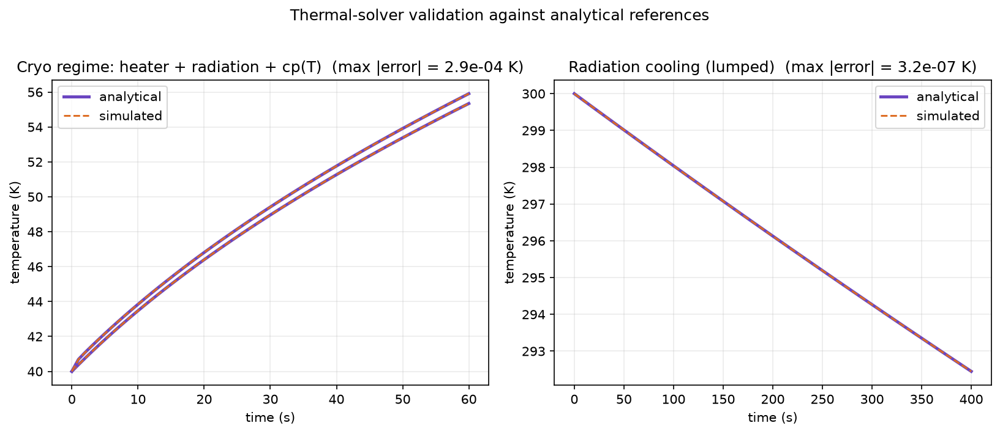
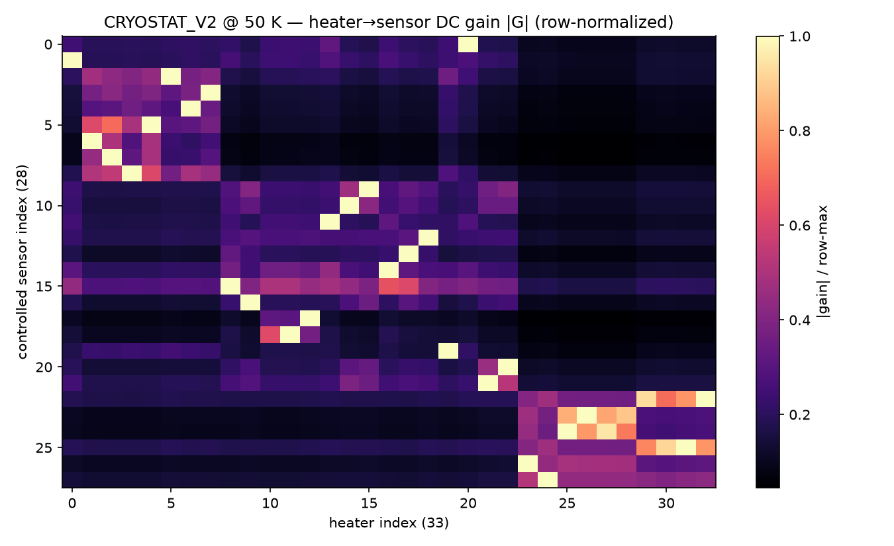
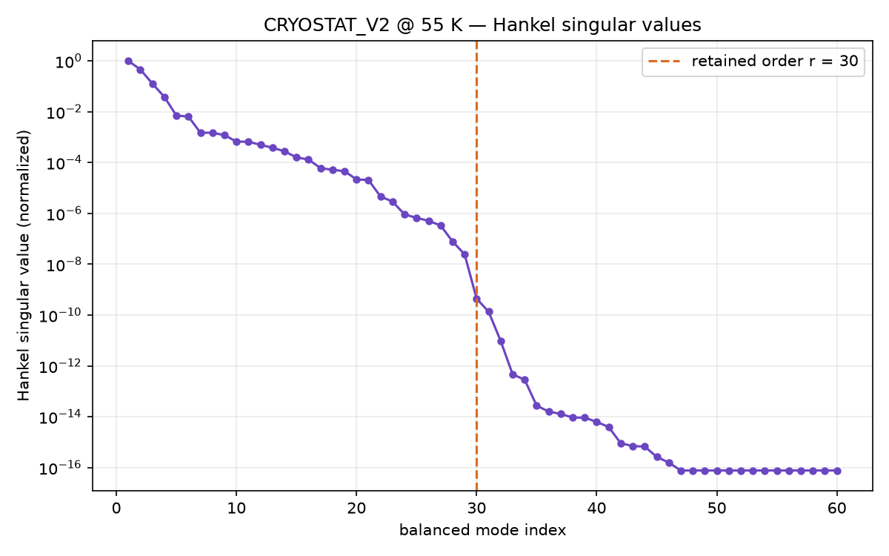
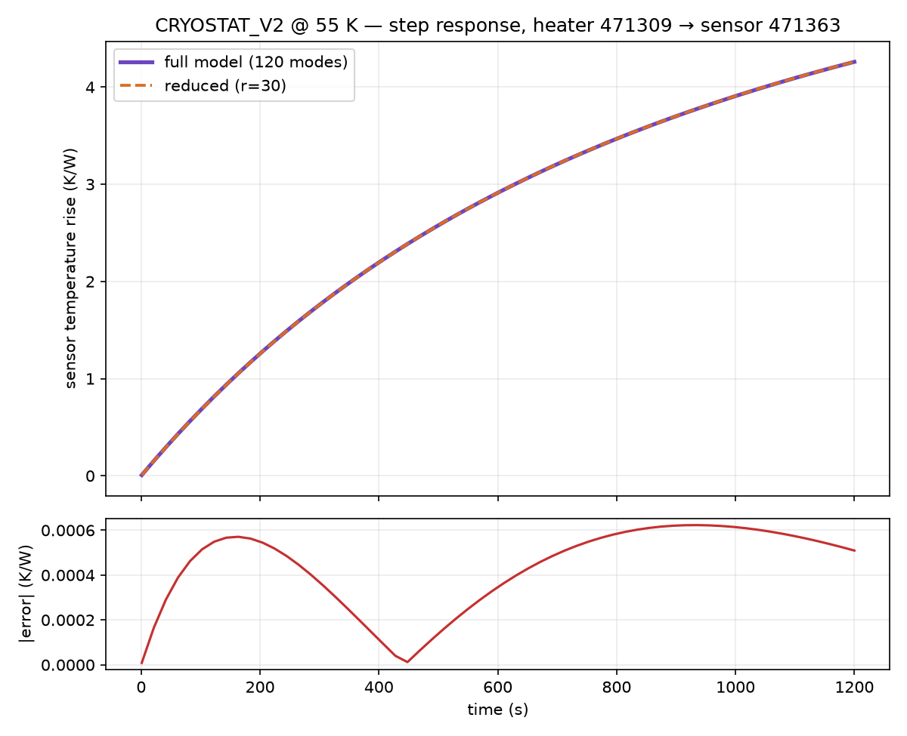
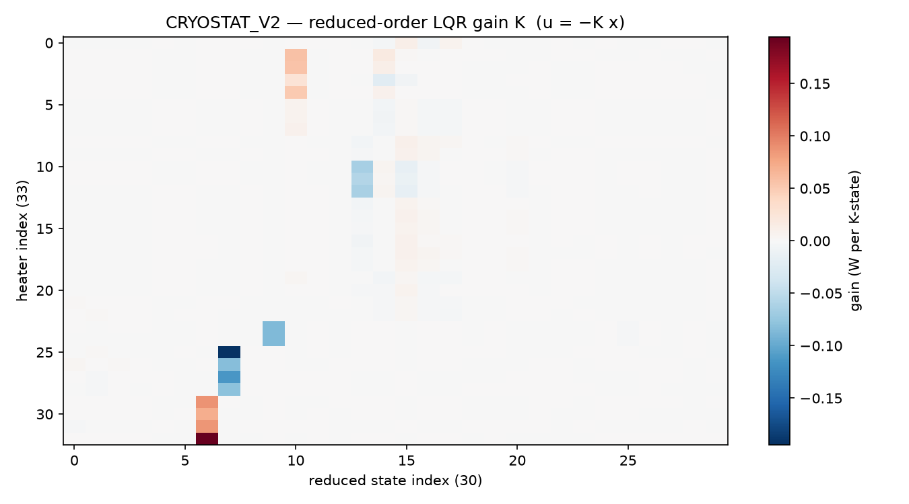

# Second Interim Report: Simulating and controlling the HISPEC thermal system

Andrey Korolev · *Mentor: Jake Zimmer* · SURF 2026

---

## Background and goal

HISPEC is a high-resolution infrared spectrograph being built for the Keck
Observatory (radial-velocity measurements, exoplanet characterization, transit
spectroscopy). Because those measurements are extremely sensitive to optical
expansion, refractive-index changes, and detector drift, the instrument must stay
thermally stable to roughly 10 mK/hour (with a sub-millikelvin stretch goal),
across a custom thermal-control system with 40 heater outputs and 80
temperature-sensor inputs (see Interim Report 1 for the hardware background).

My project is to model, simulate, and control this system. The defining
constraint is that the hardware does not physically exist yet, so I cannot do
system identification on the real device. The entire project therefore rests on an
approximate, physics-based simulator that stands in for the real system: it lets
me design and stress-test controllers now, so that when the hardware arrives the
controllers are already close and only need refinement rather than ground-up
tuning. The work over the past month falls into two threads: (1) building and
validating that simulator, and (2) evolving the controller from a simple baseline
to an optimal multivariable design.

Throughout, results are shown on a representative test assembly, CRYOSTAT_V2,
which exposes 33 heaters and 72 sensors (28 controlled), a subset of the full
40/80 channel count, linearized about a 55 K operating point.

---

## Thread 1: Building and validating the simulator

### 1.1 The pipeline

The simulator turns a CAD assembly into a solvable thermal model in three stages.
All quantities below are the actual settings used to build CRYOSTAT_V2.

(a) Geometry to octree/voxel grid. The CAD assembly is voxelized with an adaptive
octree so fine features get small cells and bulk material gets large ones. The
build parameters were: minimum cell size 4 mm, maximum cell size 10 mm, maximum
octree depth 12 (depth 9 actually reached), 64 sample points per cell for
occupancy testing, and a trimesh BVH ray-containment backend. Adaptive refinement
was enabled at material contrast (contrast ratio threshold 5), near contacts
(within 10 mm), at boundaries, and around crowded and multi-surface components.
The result for CRYOSTAT_V2 is 471,412 leaf cells (469,315 in the main connected
body) joined by about 1.08 million conduction edges (2.16 M off-diagonal entries
in the sparse conduction Laplacian). Contact between touching parts is modeled with
an interface conductance of 10,000 W·m⁻²·K⁻¹ applied where surfaces lie within a
2 mm detection distance (0.05 mm gap tolerance). Flex cables (FLEX components) were
excluded.

(b) Material extraction and assignment. Each voxel carries density, heat capacity,
conductivity, and emissivity. Because CAD appearance names are unreliable, a
per-mesh material table (Materials.xlsx) is treated as authoritative and matched
onto the octree leaves; a leaf inherits its parent component's material, with the
dominant material accepted when it covers at least 95% of a cell. CRYOSTAT_V2
resolved to 14 distinct materials, e.g. 6061-T6 aluminum (ρ = 2700 kg·m⁻³,
cp = 896 J·kg⁻¹·K⁻¹, k = 167 W·m⁻¹·K⁻¹, ε = 0.09), AISI 304 stainless
(k = 16.2 W·m⁻¹·K⁻¹, ε = 0.35), 17-7PH stainless (k = 16 W·m⁻¹·K⁻¹), and copper.
Getting this correct was a distinct piece of work (the whole simulation is only as
good as its material assignment).

(c) Thermal network. The voxel grid becomes a lumped thermal graph: node i is a
thermal mass with capacity $eq_Ci$, edges are conduction conductances $eq_Gij$
built from the shared face area, cell sizes, and harmonic-mean conductivity, and
exposed surfaces get a linearized radiation term referenced to 293.15 K. Heater
and sensor nodes are detected by component-name substring (SAFE-HEATER for
heaters, a fixed sensor part number for sensors), then paired (at most 2 heaters
per sensor, within 50 mm). At cryogenic temperatures material properties vary
strongly, so heat capacity and conductivity use temperature-dependent curves
cp(T), k(T) sourced from NIST cryogenic data rather than room-temperature
constants.

### 1.2 Validation against analytical references

Before trusting the simulator to design controllers, I checked that its heat
transfer was actually correct. The solver has a built-in suite of experiments,
each a small canonical geometry (typically a copper block or rod, e.g. a
100 × 20 × 20 mm bar with a 10 W heater, starting at 293.15 K) compared against an
independent reference: either a closed-form analytical solution, or a
high-accuracy adaptive Runge-Kutta (LSODA) integration of the same nonlinear ODE
$eq_ode$ from the identical initial state and operators. To probe correctness
rather than the deployed solver's default speed, I ran each experiment with the
solver tightened to convergence: adaptive substep cap 512, per-step target ΔT
10⁻³ K, relative tolerance 10⁻¹¹, GPU path disabled. The error reported is the
maximum absolute deviation from the reference over the run:

| Experiment | Max abs. temperature error | Tolerance | Status |
|---|---|---|---|
| Insulated block, constant heating | 1.7×10⁻¹⁰ K | 5×10⁻² K | PASS |
| Two-node lumped conductance | 3.7×10⁻¹⁰ K | 1×10⁻⁷ K | PASS |
| One-dimensional prism conduction | 1.0 K | 3 K | PASS |
| One-dimensional distributed rod | ~10⁻¹³ K | 1×10⁻⁷ K | PASS |
| Radiation cooling (lumped) | 3.2×10⁻⁷ K | 5×10⁻¹ K | PASS |
| Temperature-dependent heating | 3.2×10⁻² K | 5×10⁻¹ K | PASS |
| Cryo regime (heater + radiation + cp(T)) | 1.8×10⁻⁴ K | 5×10⁻¹ K | PASS |
| Two-block thermal exchange | 5.7×10⁻² K | 5×10⁻² K | WARNING |
| Global energy conservation | 1.8×10⁻³ J | 36 J | PASS |

The most important row is the cryo regime (heater input, radiation, and
temperature-dependent cp(T) together), which is the actual HISPEC operating
regime, where the simulator tracks the analytical reference to 1.8×10⁻⁴ K. Figure
5 overlays the simulated and analytical curves for that case and for radiation
cooling; they are visually indistinguishable. The only non-PASS is the two-block
exchange, which lands marginally over its 0.05 K tolerance (0.057 K). These results
are in line with what I expected: with the solver well resolved, the simulation
reproduces the physics to well within any tolerance that matters for control.

Figure 5. Simulated (dashed) vs. analytical (solid) temperature for the cryo
regime and radiation-cooling experiments; max errors about 10⁻⁴ K and 10⁻⁷ K.

### 1.3 The problem: hollow shells

The validation above is encouraging, but there is a significant caveat I uncovered
while pushing the model further. The CAD imports used so far (GLB exports) drop the
solid interiors of parts, leaving hollow shells. A shell has thin conduction
cross-sections and a weak connection to the cold sink, so while the solver is
correct (Section 1.2), the geometry it is solving on is not representative of the
real instrument, and absolute quantities like time constants and steady-state
gains come out distorted. The source of the problem is the file format and how it
tessellates solids: the build's own quality heuristic flagged this, scoring
CRYOSTAT_V2 5/100 (grade D) largely on watertightness and occupancy warnings. The
fix, now in progress, is a separate STEP / B-rep import path that fills solids
correctly. Re-running the whole pipeline on solid-filled geometry is the main
outstanding step to turn the current methodology demonstration into a
quantitatively representative model.

---

## Thread 2: Controller design

### 2.1 Why the problem is multivariable

The control problem is naturally MIMO: heat from one heater reaches many sensors.
Using the earlier, well-grounded model build, the steady-state heater-to-sensor
gain matrix G (28 controlled sensors × 33 heaters; $eq_yGu$) is well-conditioned
(condition number about 37, entries 0.04 to 0.87 K/W) and shows that coupling is
pervasive: on average 26.8 of the 33 heaters significantly influence each sensor,
and the relative gain array has a mean best-pairing value of 1.47 (1.0 would mean
perfectly decoupled loops). Figure 4 shows the structure: clear dominant pairings,
but with large off-diagonal coupling blocks. The system also has two structural
difficulties carried over from Report 1: it is underactuated in sensor space (80
sensors, 40 heaters on the real device), and the heaters are one-sided actuators
that can only add heat, not remove it, so an overshoot must wait for passive or
cryocooler cooling.

Figure 4. Row-normalized steady-state gain |G| (earlier well-conditioned build).
The off-diagonal energy within each block is the cross-coupling that rules out
independent single-loop control.

### 2.2 The controller evolution

SISO PID. The first attempt was the simplest thing that could work: an independent
PID loop per heater/sensor pair. This is a useful baseline but, given the coupling
above, each loop fights the others and it cannot hold a coordinated setpoint.

Decoupled MIMO PID. To account for the coupling, the next controller computed a
desired correction in sensor space and mapped it to heater powers through the
pseudoinverse of the gain matrix, $eq_pinv$. This works on paper, but the
pseudoinverse can request negative or over-limit heater powers. Since real heaters
must satisfy $eq_ulim$, those commands have to be clamped, and once clamped the
applied heater vector is no longer the one the decoupling assumed, so the
decoupling breaks down.

Constrained min-norm QP. To fix the clamping problem at its source, I moved to a
controller that solves a small constrained quadratic program each step: produce
the desired temperature-space correction as closely as possible while directly
enforcing the heater constraints (and penalizing large jumps), rather than
inverting and clamping afterward.

The deeper issue. All of the above are built on the steady-state gain G, and G has
two problems. First, it captures only the settled behavior, not the transient
dynamics that actually govern control. Second, it is only as good as the model it
comes from: on the real hardware it would require system identification I cannot
yet perform, and it can be badly conditioned (the shell-geometry rebuild from
Thread 1, for instance, degrades G from the well-behaved matrix above into a
nearly rank-1, hugely ill-conditioned one). A controller whose core is a static,
model-derived inverse is therefore fragile. This motivated moving to a controller
built on the dynamics.

### 2.3 The LQR controller

From a giant plant to a small dynamic model. A dynamic controller needs a
state-space model $eq_ssfull$, but the full thermal graph is >500,000 states,
which is far too large to design against or run on a microcontroller. I reduce it
in two stages:

1. Modal reduction. Solve the generalized symmetric eigenproblem $eq_eig$ for the
   natural thermal modes by symmetric shift-invert (eigsh, shift σ ≈ 0), keeping
   the 120 slowest (largest time constants) and C-orthonormalizing them
   ($eq_orthon$); fast modes settle instantly on control timescales. Projecting
   onto these gives a 120-state model $eq_modal$.
2. Balanced truncation. Slow does not mean useful: a mode only matters if it
   actually connects a heater input to a sensor output. I solve the controllability
   and observability Lyapunov equations for the 120-state model, take the Hankel
   singular values from their gramian factors (each measuring a mode's joint
   controllability and observability), and apply square-root balancing to keep the
   top r = 30. The Hankel values (Fig. 1) fall off a cliff, dropping about four
   orders of magnitude by mode 10 and reaching machine precision by mode 45, so 30
   states capture essentially all of the input/output behavior. The reduced
   30-state model reproduces the full model's steady-state gain to 1.3×10⁻³ and its
   step response to 1.5×10⁻³ (about 0.15%; Fig. 2), and is stable. This is the key
   result that makes everything downstream trustworthy: the model is small enough
   to run on the target microcontroller yet faithful to the real dynamics.

Figure 1. Hankel singular values (normalized); r = 30 (dashed) retains all
meaningful input/output dynamics.

Figure 2. Full (120-mode) vs. reduced (r = 30) step response for the dominant
heater-to-sensor pair; the reduction preserves the input/output map to about
0.15%.

The LQR design. On the 30-state model (linearized about T_op = 55 K) I design a
linear-quadratic regulator: choose the feedback $eq_uKx$ that minimizes the cost
$eq_cost$, which trades tracking accuracy against heater effort. The gain K
(33 × 30) comes from solving the associated algebraic Riccati equation, with effort
weight ρ = 0.3. The supporting pieces use a Tikhonov regularization fraction of
10⁻³ for the static estimator and an integral gain of 0.08. Why LQR is the right
tool here: it produces an optimal, fully coordinated multivariable law, where every
heater's command uses the entire state estimate, so the controller actively works
with the cross-coupling instead of fighting it, which is exactly what independent
PID loops cannot do. Figure 3 shows this directly: K is dense, and several heaters
draw on shared modes. Around the LQR core sit three supporting pieces: a static
state estimator that reconstructs the 30 states from the 72 sensor readings, a
regularized steady-state feedforward that supplies the open-loop power to reach a
setpoint, and an integral term that removes residual offset from model error and
the uncertain radiation load.

Figure 3. LQR feedback gain K (u = −Kx); its density shows genuinely coordinated
multivariable control across all 33 heaters.

The main drawback: one-sided inputs. LQR is optimal for unconstrained,
bidirectional inputs, but HISPEC's heaters can only add heat ($eq_uge$) and are
capped ($eq_ulem$). When the ideal LQR command would be negative, i.e. the
controller wants to cool, it simply cannot, and must wait for passive or
cryocooler cooling; when it saturates high, the optimality guarantees no longer
hold. Right now this is handled pragmatically with clamping, output slew-limiting,
and integral anti-windup, but that is a patch on top of a controller that does not
know about the constraint. The controller also inherits any error in the reduced
model.

How I am addressing the deficiencies. Two directions:

- Adaptive feedforward: update the steady-state feedforward online so it absorbs
  model error and the (poorly known) radiation load instead of relying on a fixed,
  model-derived gain. This directly attacks the "G is unreliable" problem.
- Reduced-order MPC: model-predictive control on the same 30-state model, which
  handles the input constraints ($eq_ulim$, slew limits) explicitly and optimally
  rather than by clamping. This is the principled fix for the one-sided actuation,
  and the small reduced model is what makes MPC computationally feasible for
  on-board use.

---

## Problems encountered, and remaining goals

Problems and how I am solving them.

- Hollow-shell geometry (Thread 1): the GLB import drops solids, so absolute
  numbers are unrepresentative. Being fixed with a STEP/B-rep solid-fill import.
- One-sided, constrained actuation (Thread 2): breaks LQR optimality; being
  addressed with adaptive feedforward and reduced-order MPC.
- Reliance on a model-derived gain without system identification: the whole
  approach exists precisely to sidestep sys-id on absent hardware, but it means the
  controllers must be robust to model error, hence the integral action now and
  adaptive feedforward next.

Goals for the remainder, and how they have changed. The immediate goals are: (1)
re-run the pipeline on solid-filled STEP geometry for a representative model; (2)
implement adaptive feedforward and a reduced-order MPC to handle the one-sided
constraints properly; (3) add surface-to-surface radiative coupling and rebuild the
conduction operator with k(T) at the operating point for higher fidelity; and (4)
eventually validate against the real hardware once it exists. The emphasis has
shifted since the start: the project began focused on getting a forward simulation
to run with a basic PID, but as the coupling and constraint structure became clear,
the center of gravity moved to model reduction and optimal, constrained
multivariable control, and, in parallel, to improving the simulator's physical
fidelity from shells to filled solids.

---

Figures generated from the CRYOSTAT_V2 model; see docs/surf_report/make_figures.py
and the validation runner. Background and hardware details are in Interim Report 1.
