# HeatTransferSim — User Guide

HeatTransferSim turns a CAD assembly into a lumped thermal model, simulates it
closed-loop against a multi-input controller, and exports that controller as
constants you can flash to a microcontroller.

This guide is written for someone who has the repository and needs to get a
result out of it. Every screenshot is generated from the application's own
widgets by `tools/make_tutorial_screenshots.py`, so the pictures cannot drift
away from the software the way hand-cropped ones do.

---

## Contents

1. [What the application is for](#1-what-the-application-is-for)
2. [Installing and launching](#2-installing-and-launching)
3. [The five tabs](#3-the-five-tabs)
4. [Finding anything: the help search](#4-finding-anything-the-help-search)
5. [Your first simulation](#5-your-first-simulation)
6. [The controller](#6-the-controller)
7. [Exporting the controller](#7-exporting-the-controller)
8. [Long runs](#8-long-runs)
9. [Checking the solver](#9-checking-the-solver)
10. [Where files live](#10-where-files-live)
11. [When something goes wrong](#11-when-something-goes-wrong)

---

## 1. What the application is for

A cryogenic instrument has many heaters and many temperature sensors, coupled
through one metal structure. Turning on any heater moves *every* sensor. The
problem this software exists to solve is: given the CAD, what commands should
each heater receive to hold every sensor at its setpoint?

It answers that in three stages.

| Stage | What it does | Where it lives |
|---|---|---|
| **Build** | CAD (GLB or STEP) → octree → a lumped RC thermal graph | `octree_graph/`, run via `hts-build-graph` |
| **Simulate** | Solve that graph forward in time with a controller in the loop | The application, `graph_visualizer/` |
| **Deploy** | Write the controller out as constants | `hts-export-controller`, or a button in the app |

A short piece of vocabulary used throughout:

- **Cell / node** — one lumped mass at a uniform temperature. A graph has
  hundreds of thousands of them.
- **Graph** — the whole network of cells and the conductances between them,
  saved as a folder under `graphs/`.
- **Heater / sensor** — cells tagged with a role. Heaters take power in; sensors
  are where temperature is measured and regulated.
- **G** — the DC gain matrix, in kelvin per watt. `G[i][j]` is how far sensor *i*
  settles when heater *j* gets one watt. This matrix *is* the controller's model
  of the plant.

---

## 2. Installing and launching

Needs Python 3.11 or newer.

```powershell
python -m pip install git+https://github.com/JustKorolev/HeatTransferSim
heattransfersim
```

That is the whole install: `heattransfersim` launches the application from any
directory. If you intend to change the code, clone it and install in place
instead:

```powershell
git clone https://github.com/JustKorolev/HeatTransferSim
cd HeatTransferSim
python -m pip install -e ".[dev]"
```

Installing also puts the pipeline on your PATH as commands:

| Command | Does |
|---|---|
| `heattransfersim` | Launch the application |
| `hts-build-graph` | CAD → octree → thermal graph |
| `hts-run` | Headless closed-loop run |
| `hts-export-controller` | Write the controller out as constants |
| `hts-build-modal` | Reduce a graph and design the modal LQR controller |
| `hts-build-g` | Solve the DC gain matrix G |
| `hts-refresh-fast-load` | Rebuild a graph's fast-load artifacts |

These are the same modules the application launches as background jobs, so a
command and the app's own subprocess run identical code.

If you need the STEP/B-rep build pipeline, it depends on OpenCASCADE, which has
no pip wheel on any platform. GLB input needs nothing extra; for STEP, use conda:

```powershell
conda env create -f environment.yml
conda activate heatsim
python -m pip install -e .
```

> **Note.** The graph builder also needs `embreex` for fast ray tests. Without
> it the build is roughly sixty times slower, so it fails fast rather than
> appearing to hang. Pass `--allow-slow-contains` if you really want the slow
> path.

The application does not create graphs. It loads ones that `hts-build-graph`
has already written into `graphs/`.

---

## 3. The five tabs

| Tab | Use it to |
|---|---|
| **3D Octree Graph Editor** | Look at the cells in 3D. Select them, tag heaters and sensors, assign materials, cut a cross-section through the assembly. |
| **2D Network Graph** | See the same graph as a flat network of conductive links. Read-only. |
| **Heat Transfer Simulation** | Run the model live with the controller in the loop, identify the plant, design and export the controller. |
| **Thermal Validation** | Drive the real solver against cases with a known answer and read the error. |
| **Headless Run** | Launch a long run as a separate process that survives closing the app. |

In octree mode the geometry and topology are **read-only**. They come from CAD,
so the app will not let you edit them; what you can change is the *labelling* —
which cells are heaters, which are sensors, what material each part is, and what
each one is connected to thermally.

The two simulation tabs deliberately share one control panel, built by one piece
of code. If a setting exists on one, it exists in the same place on the other.

---

## 4. Finding anything: the help search

The application has roughly two hundred controls, most named for the control
theory behind them rather than for what you are trying to do. Rather than
hunting, **press `Ctrl+F`**.

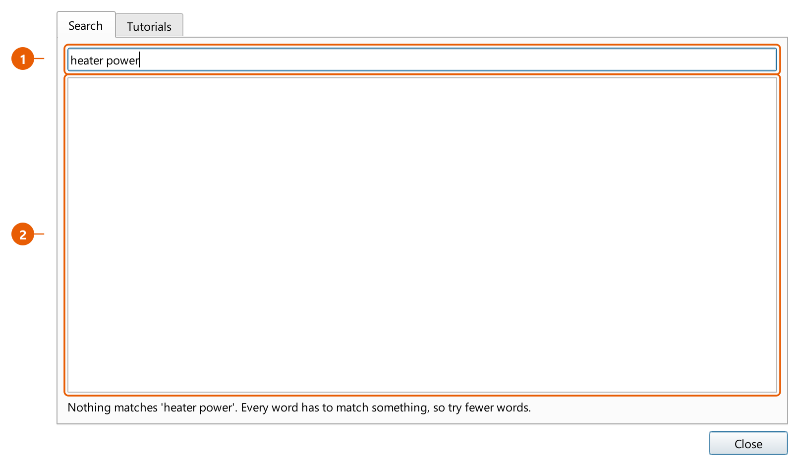

1. **Type what you want, in your own words.** "heater power", "checkpoint",
   "ambient", "firmware". Search runs as you type, so a prefix is enough.
2. **The results name the full path** — tab, then section, then the control.

Click a result (or press Enter for the first one) and the application switches to
the right tab, scrolls the control into the middle of the panel, and pulses an
orange outline around it. You are looking at the control, not at a description of
where it might be.

Every word you type has to match something, so adding a word *narrows* the list.
`heater` alone returns a lot; `heater slew` returns one.

Press **`F1`** for the tutorials, which cover the same ground as this guide but
inside the application:

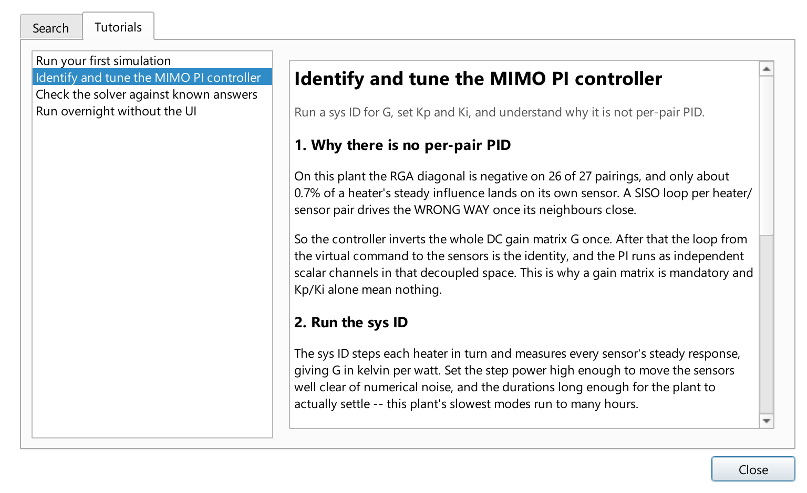

Steps that mention a specific control carry a **"Show me this control"** link
that reveals and flashes the real widget.

### The menus

| Menu | Holds |
|---|---|
| **File** | New / Open / Save / Save As, **Export Controller Constants** (`Ctrl+E`), Update Graph, Exit |
| **View** | The UI scale slider, larger/smaller text, dark mode |
| **Help** | Control search (`Ctrl+F`), tutorials (`F1`), About |

**View** carries a live **UI scale slider**, 40% to 200%. Drag it and the whole
interface resizes as you watch; `Ctrl` `+` and `Ctrl` `-` step it, `Ctrl` `0`
returns to 100%. The setting is remembered between sessions.

It scales by *font size* rather than zooming a picture of the interface, so
panels, rows and buttons all grow with the text instead of the text overflowing
boxes that stayed the same size. The range goes well below 100% on purpose: on a
display whose DPI Qt over-estimates, everything is already too large before the
application gets a say, and the only useful correction is downward.

---

## 5. Your first simulation

Open the **Heat Transfer Simulation** tab and choose a graph from the dropdown at
the top. Then work down the **Run** section.

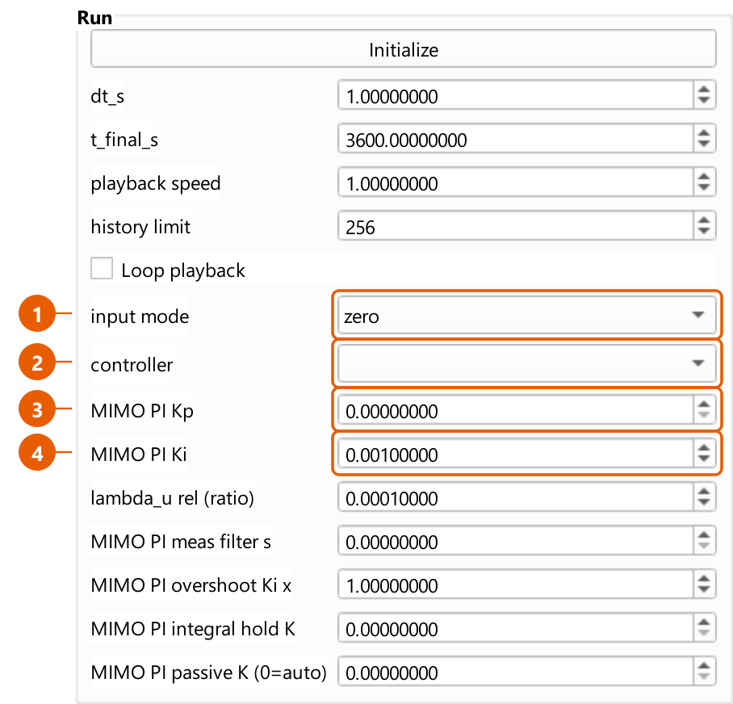

1. **input mode** — `zero` runs the plant with no heater input at all, which is
   how you watch it drift to its passive equilibrium. `heater_inputs` is the one
   that closes the loop.
2. **controller** — which scheme regulates the heaters. `(no controller
   selected)` leaves them unregulated, so the run is open-loop apart from
   cryocoolers and any manual heaters.
3. **MIMO PI Kp** — proportional gain, per controlled sensor.
4. **MIMO PI Ki** — integral gain, per controlled sensor.

Above those, `dt_s` is the control period and `t_final_s` is how long the run
covers in simulated seconds.

Press **Initialize** to build the operator matrices and prepare the solver, then
**Play**. The 3D view recolours as the simulation advances.

> **A graph above about 250,000 cells will warn you before it tries to draw
> itself.** Live visualisation of a multi-million-cell model is slow and
> memory-hungry. For anything long, use the Headless Run tab (section 8).

### Environment

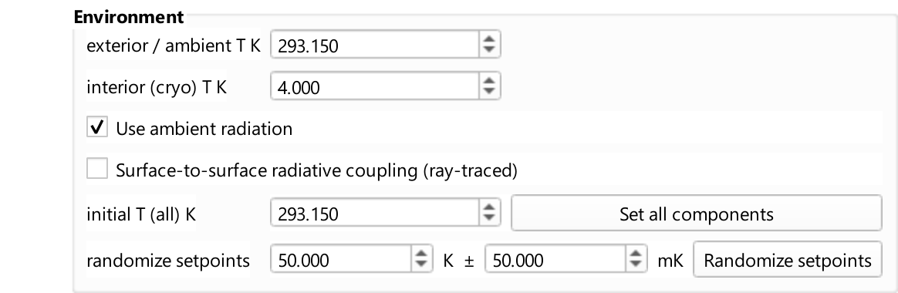

Two radiative backgrounds, and the distinction matters. The **exterior** is the
room the outside of the assembly radiates to. The **interior** is the cryocooled
vacuum enclosure the inner surfaces see. Which surfaces get which is decided by
the view-factor classification; until that runs, everything radiates to the
exterior.

### Material properties

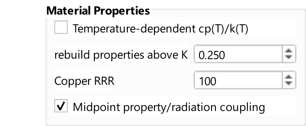

At cryogenic temperatures, specific heat and thermal conductivity are not
constants — copper's conductivity varies by orders of magnitude between 4 K and
room temperature. Turning on temperature-dependent properties makes the solver
evaluate them at each cell's current temperature instead of using a single value.

### Cryocooler

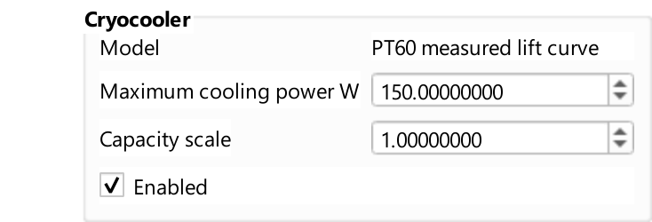

The cooler is modelled by its **lift curve**: how much heat it removes as a
function of its own tip temperature. It is not a fixed heat sink, and this is why
"how much cooling do I have?" only has an answer once you know how cold the tip
is.

---

## 6. The controller

### Why it is not one PID per heater

The obvious design — pair each heater with its nearest sensor and give each pair
a PID loop — **does not work on this plant**, and it is worth understanding why
before you tune anything.

On the reference assembly, only about **0.7%** of a heater's steady influence
lands on its own sensor. The rest goes everywhere else. Worse, the relative gain
array has a **negative diagonal on 26 of 27 pairings**: once the neighbouring
loops close, a pair's loop drives in the *wrong direction*.

So the controller does not pair anything. It inverts the whole gain matrix `G`
once. After that inversion, the loop from a virtual command to the sensors is the
identity, and the PI runs as independent scalar channels in that decoupled space.

This is why **a gain matrix is mandatory** and why Kp and Ki alone do not define
this controller.

### Step one: identify the plant

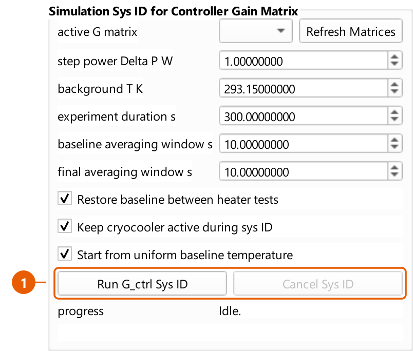

The sys ID steps each heater in turn and measures every sensor's steady response,
producing `G` in kelvin per watt.

Two settings decide whether the result is any good:

- **Step power** must be large enough to move the sensors clear of numerical
  noise.
- **Durations** must be long enough for the plant to actually settle. This plant's
  slowest modes run to many hours; a test that stops early measures a transient
  and calls it a steady state.

The result is saved as a run folder under the graph's `sys_id/`.

### Step two: set the gains

After decoupling, every channel has unit DC gain, which makes the tuning
unusually direct:

- `Ki = 1 / lambda`, where lambda is the closed-loop time constant you want.
- `Kp = tau / lambda`.

**Do not ask for a lambda faster than the plant's fastest retained mode.** The
model truncates the fast dynamics, so commanding faster than it excites
behaviour the model does not contain. Starting at `Kp = 0` gives feedforward plus
integral, which is a reasonable place to begin; raise it if the approach is too
sluggish.

### Step three: the limits

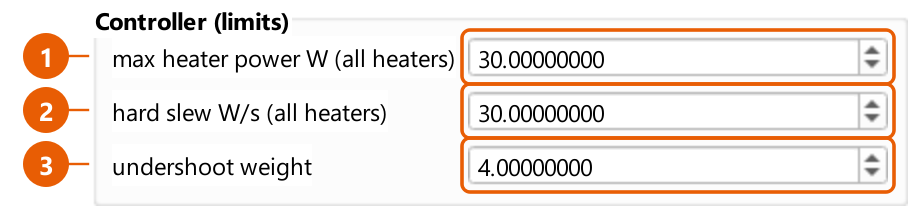

1. **max heater power W (all heaters)** — a **ceiling** on every heater, not a
   fallback for ones that lack a rating. A heater rated below it keeps its lower
   rating; a per-heater override in the run table beats it outright. `0` means no
   ceiling.
2. **hard slew W/s (all heaters)** — the maximum rate of change of a heater's
   *commanded* power. This models the driver electronics, not the thermal
   response, which is already in the model. At any sane `dt` it is non-binding.
   Lower it only to encode a real constraint: a rate limiter that binds costs
   phase margin and can drive oscillation.
3. **undershoot weight** — how much more the allocator dislikes leaving a sensor
   *short* of its target than pushing it past. `1.0` is symmetric. Symmetric is
   usually wrong here, because heating the coldest sensor necessarily overshoots
   a neighbour that is nearly right, and a symmetric objective scores that
   overshoot as badly as the cold it removes — so the command stops early.

### The allocator

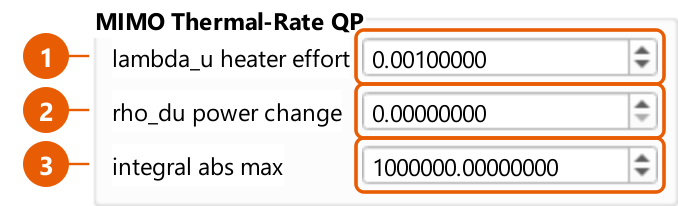

Heater commands come from a bounded least-squares solve, not a raw matrix
inversion. That matters when heaters saturate: the solver redistributes demand
onto the unsaturated heaters instead of truncating each channel independently.

1. **lambda_u** — how much the solve penalises control effort. Directions the
   plant barely has cost enormous power for almost no temperature, and inverting
   through them makes the allocation flip between near-equivalent answers from
   step to step.
2. **rho_du** — penalises *changes* in power between steps.
3. **integral abs max** — a hard clamp on the accumulated integral.

---

## 7. Exporting the controller

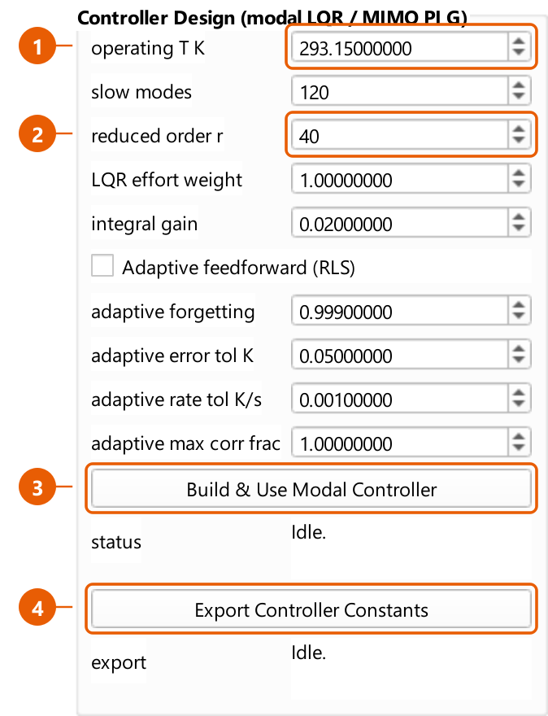

1. **operating T K** — the temperature the plant is linearised about. Both
   controller builds read this one field, so the modal artifact and the gain
   matrix describe the same linearisation and can be compared.
2. **reduced order r** — how many states the reduced model keeps.
3. **Build && Use Modal Controller** — runs the model reduction and LQR design in
   the background, then loads the result.
4. **Export Controller Constants** — writes the controller out.

The export produces two files:

| File | For |
|---|---|
| `controller_constants.h` | Firmware. Dependency-free C, every array `static const float`, sized by `#define`. |
| `controller_constants.json` | Tooling, and reading back into the app. |

Both carry the gain matrix `G`, its regularised inverse, per-sensor Kp/Ki and
setpoints, per-heater power and slew limits, every loop-shaping constant, and
provenance naming the gain matrix and commit they came from. The header states
the control law in a comment block at the top.

The same export is available from the command line:

```powershell
hts-export-controller --graph graphs/CRYOSTAT_V2
hts-export-controller --graph graphs/CRYOSTAT_V2 --list
```

> **Read the two warnings the export prints.**
>
> The application allocates power with a bounded solver that a microcontroller
> generally will not carry, so the header ships a regularised inverse instead.
> That substitution is *exact* only when the undershoot weight is 1 and no heater
> is bounded. The export runs the real allocator at export time and tells you the
> measured deviation in watts rather than claiming they agree.
>
> If no passive reference is available, the header defines
> `PASSIVE_REFERENCE_UNKNOWN` instead of emitting a zero, and tells the firmware
> to latch it from a quiet plant. A zero there would silently bias every command.

---

## 8. Long runs

The **Headless Run** tab never loads a graph into the application window. That is
the entire point of it: a multi-million-cell model will not fit beside the 3D
viewer, and redrawing during an overnight run is wasted work. It lists graphs by
reading a file header, launches the run as a **detached process** that survives
closing the app, and monitors it by polling that run's own status file.

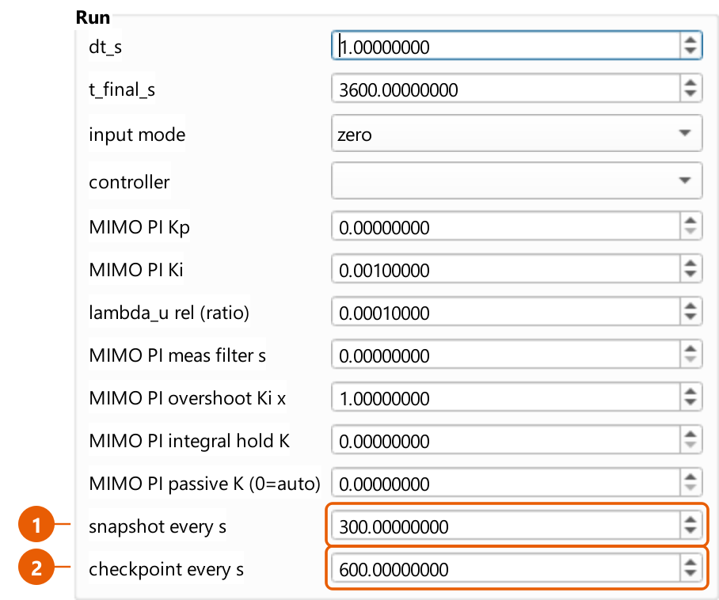

1. **snapshot every s** — how often the series you will plot is sampled.
2. **checkpoint every s** — how often a full restart point is written.

The difference matters. Checkpoints are large — multiple megabytes on a big graph
— and include the controller's integrator state so a resume genuinely continues
the run rather than restarting it. The interval is a real trade-off between disk
and how much you lose if the run dies.

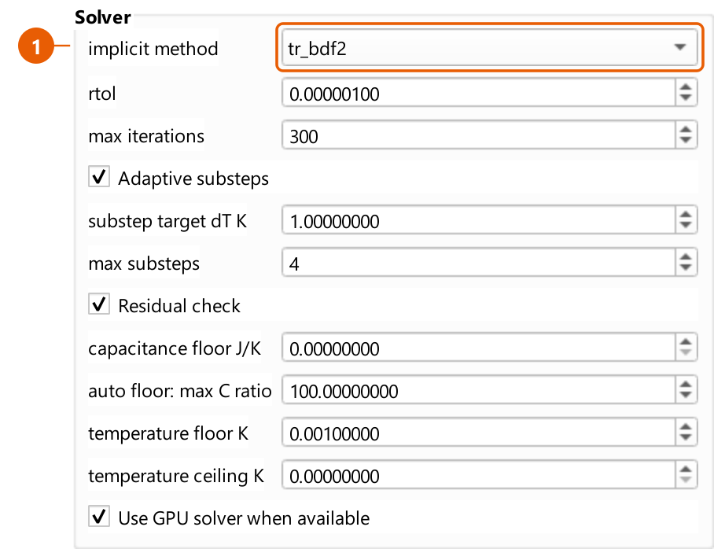

The solver settings are shown here and hidden on the live tab, because an
overnight job is exactly where they decide whether the run converges or crawls.
`tr_bdf2` is the more accurate implicit method; `backward_euler` is more robust
and more damped.

Each run writes `simulations/<graph>/<timestamp>/` containing the series, plots,
`status.json`, `events.log`, the exact parameters it ran with, and the
checkpoints.

The same thing from a shell:

```powershell
hts-run --graph graphs/CRYOSTAT_V2 --setpoint 80 --duration 3600 --dt 1
```

---

## 9. Checking the solver

The **Thermal Validation** tab drives the *real* solver — the same code path a
production run uses — against cases whose answer is known independently:
one-dimensional conduction, lumped radiation cooling, temperature-dependent
heating, and a published experimental benchmark.

This is not a unit test suite. It reports the error against each reference so you
can judge whether a modelling choice is good enough for what you are doing.
**Export Results** writes the per-case error series to CSV, which is what you
want when a change moves a number and you need to say by how much.

---

## 10. Where files live

```text
graphs/<name>/                 a built graph
  graph.json                   cells, edges, roles, materials
  nodes.csv                    fast-load index, written at BUILD time
  C.npy, L.npy, G_rad.npy      capacitance, Laplacian, radiation
  simulation_parameters.json   this graph's saved settings
  sys_id/<run>/                identified gain matrices
  controller_export/           exported controller constants

simulations/<graph>/<stamp>/   one run
  status.json, events.log      progress, and what happened
  checkpoints/                 restart points
  plots/                       figures
```

> **`nodes.csv` is written when the graph is built, not when you edit it.**
> Changes made in the application — cryocooler assignments, materials, roles — go
> into `graph.json`. If you edit a graph and then want headless runs to load it
> the fast way, press **Update graph** (or run `hts-refresh-fast-load`) to
> regenerate `nodes.csv`. The application checks for staleness and falls back to
> the slow loader rather than silently simulating a model with no heaters in it.

Neither `graphs/` nor `simulations/` is tracked in version control. Graphs are
rebuilt from CAD; runs are reproducible from the graph plus their own saved
parameters.

---

## 11. When something goes wrong

**The controller is not doing anything.**
Check `input mode` is `heater_inputs` — in `zero` mode nothing drives the
heaters. Then check a controller is selected: the placeholder row regulates
nothing.

**"MIMO PI gain matrix unavailable".**
The selected gain matrix does not match this graph, usually because it was
identified on a different one. The node ids it names have to exist here. Re-run
the sys ID.

**Every sensor sits below setpoint while heaters idle.**
The classic symptom of a symmetric objective on a coupled plant. Raise the
**undershoot weight**; see section 6.

**A channel tracks badly no matter how you tune it.**
It may not be mistuned but *unreachable* — no non-negative heater command can
serve it, because serving it would require cooling somewhere and heaters only
heat. The run's diagnostics report reachability per sensor precisely so these two
cases can be told apart.

**A run stopped and `status.json` still says "running".**
That is a native crash, not a Python exception, so there is no traceback. Look
for `crash.log` in the run folder: a low-level stack for every thread is written
there as the process dies, and it is the only evidence there will be.

**A graph build exits complaining about `embreex`.**
Install it. Without it the geometry tests are about sixty times slower, so the
build refuses rather than appearing to hang. `--allow-slow-contains` overrides
this.

---

## Regenerating this guide's screenshots

```powershell
python tools/make_tutorial_screenshots.py
```

Images are written to `docs/user_guide/images/`. Each one is captured from the
application's own widgets, and the callouts are placed from the widgets' real
geometry, so a renamed or moved control changes the picture rather than leaving a
stale one behind. The script prints a warning if a control it wants to annotate
no longer exists.

The 3D viewer is not captured by default: it needs a real OpenGL context, which
is unavailable when rendering offscreen. Add `--with-viewer` on a machine with a
display to include it.
