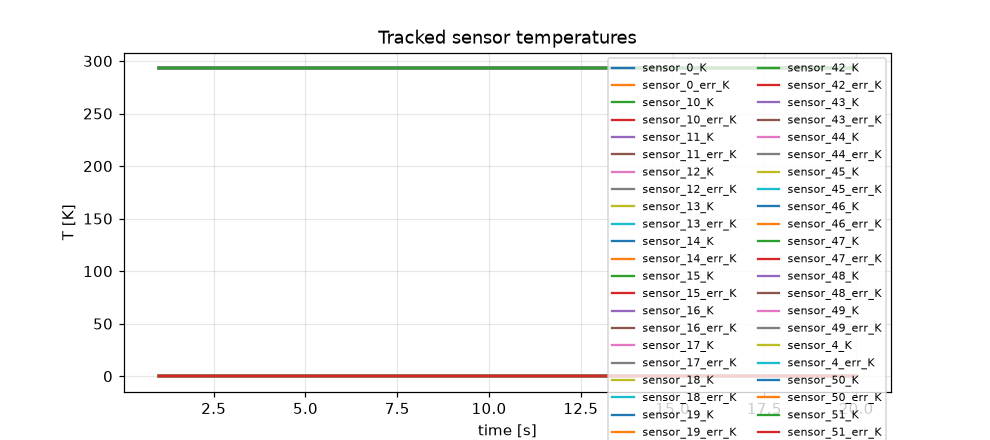
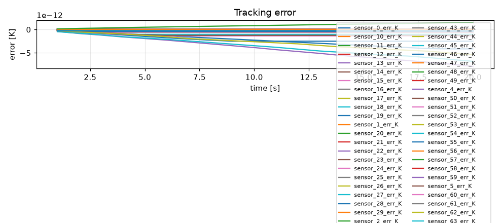
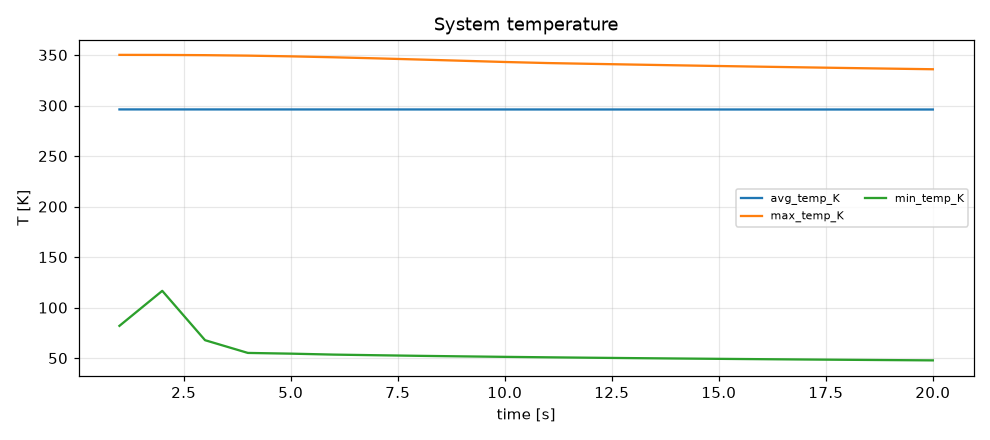
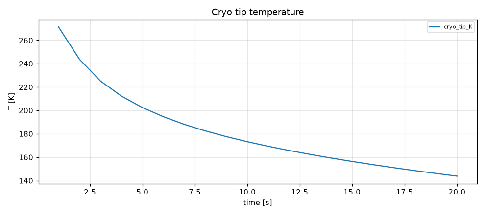
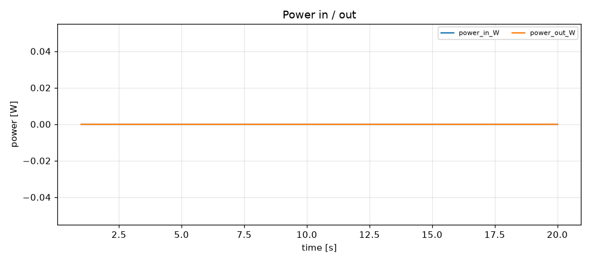
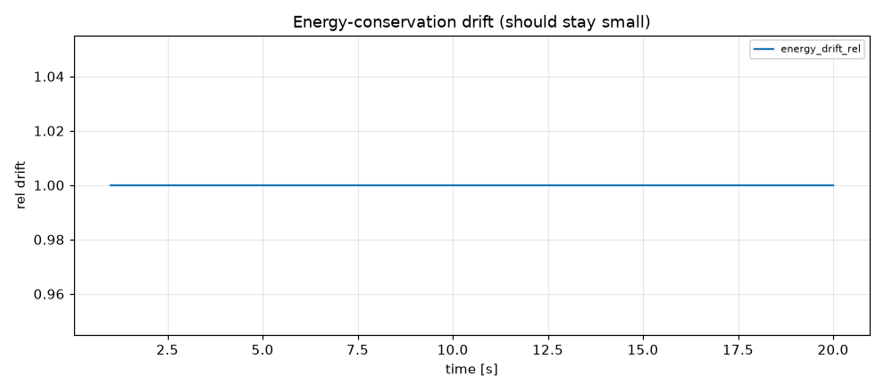

# Simulation report — CRYOSTAT_V2

- **Status:** completed
- **Output:** `simulations\CRYOSTAT_V2\20260803-150049`
- **Wall time:** 124.6 s
- **Sim time reached:** 20.0 / 20.0 s
- **Steps:** 20

## Summary metrics
- steps: 20
- sim_time_s: 20
- final_rms_tracking_error_K: 1.52549e-12
- peak_rms_tracking_error_K: 1.52549e-12
- peak_max_temp_K: 350.105
- final_cryo_tip_K: 143.836
- peak_power_in_W: 0
- max_energy_drift_rel: 1

## Plots
- 
- 
- 
- 
- 
- 

## Events
See `events.log`.