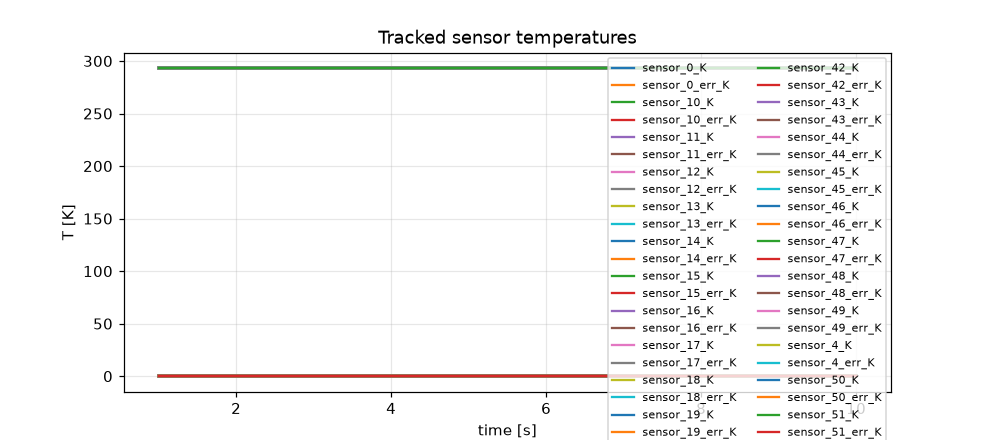
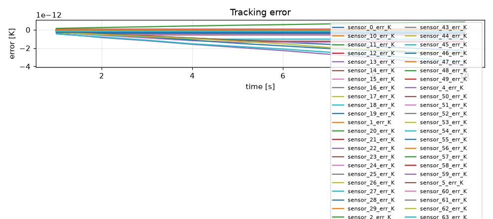
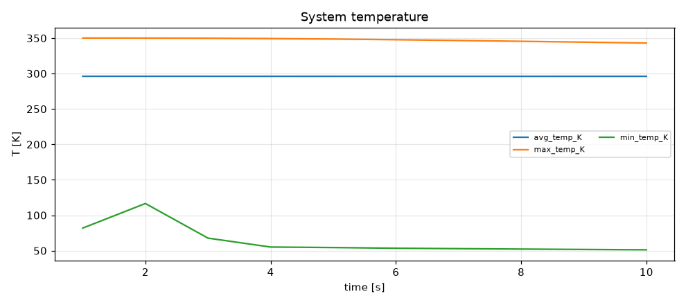
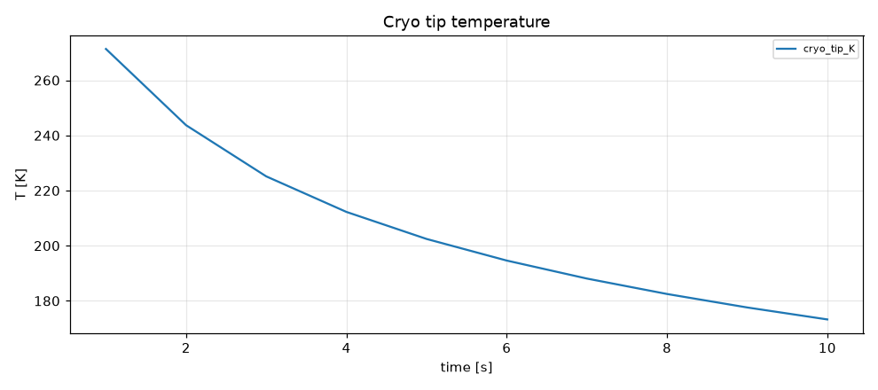
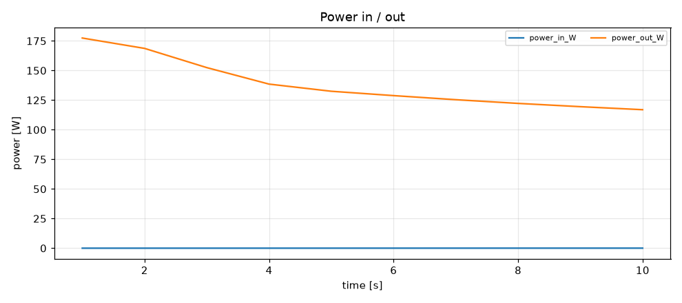
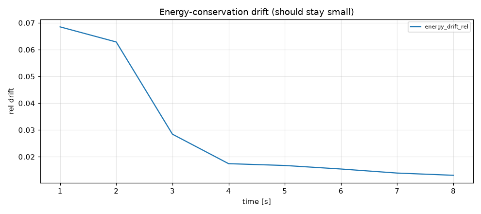

# Simulation report — CRYOSTAT_V2

- **Status:** completed
- **Output:** `simulations\CRYOSTAT_V2\20260803-150517`
- **Wall time:** 120.4 s
- **Sim time reached:** 10.0 / 10.0 s
- **Steps:** 10

## Summary metrics
- steps: 10
- sim_time_s: 10
- final_rms_tracking_error_K: 8.43151e-13
- peak_rms_tracking_error_K: 8.43151e-13
- peak_max_temp_K: 350.105
- final_cryo_tip_K: 173.254
- peak_power_in_W: 0.0351572
- max_energy_drift_rel: 0.0684988

## Plots
- 
- 
- 
- 
- 
- 

## Events
See `events.log`.