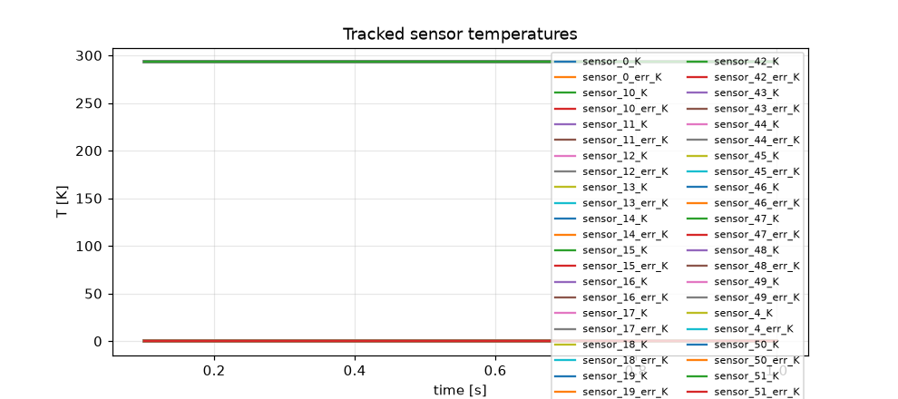
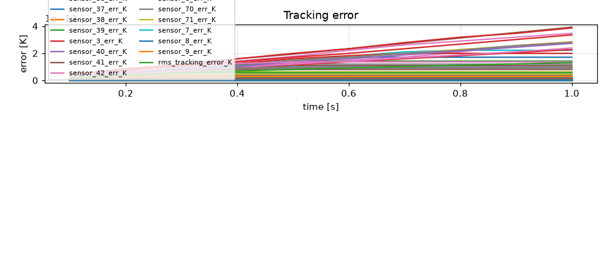
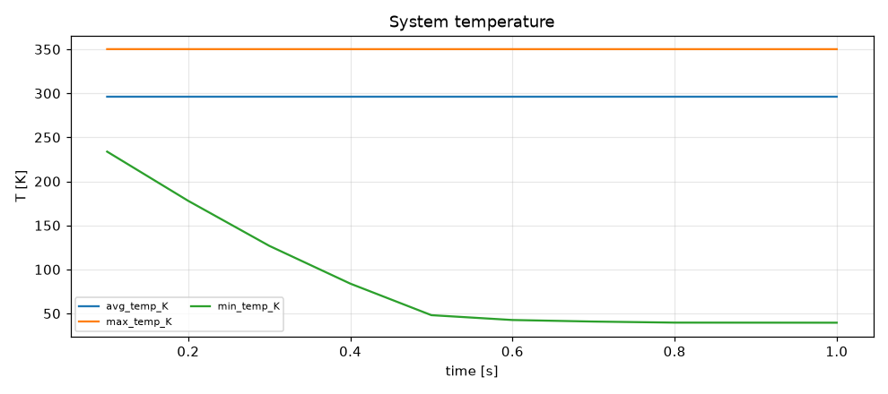
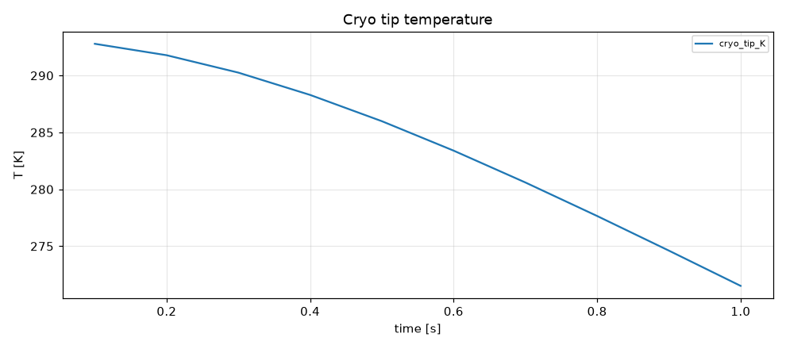
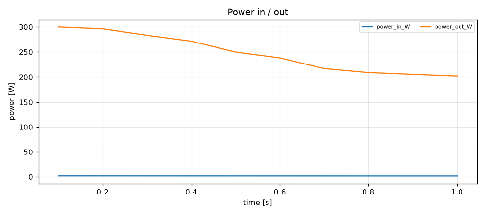
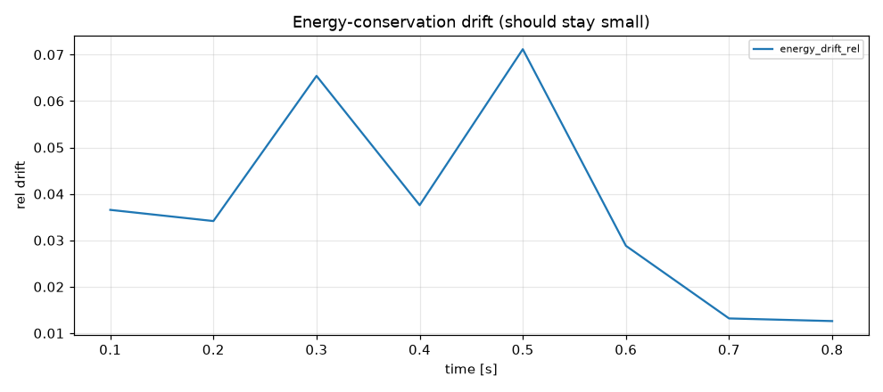

# Simulation report — CRYOSTAT_V2

- **Status:** completed
- **Output:** `simulations\CRYOSTAT_V2\20260803-154602`
- **Wall time:** 65.0 s
- **Sim time reached:** 1.0 / 1.0 s
- **Steps:** 10

## Summary metrics
- steps: 10
- sim_time_s: 1
- final_rms_tracking_error_K: 1.31113e-12
- peak_rms_tracking_error_K: 1.31113e-12
- peak_max_temp_K: 350.146
- final_cryo_tip_K: 271.51
- peak_power_in_W: 1.76695
- max_energy_drift_rel: 0.0711611

## Plots
- 
- 
- 
- 
- 
- 

## Events
See `events.log`.