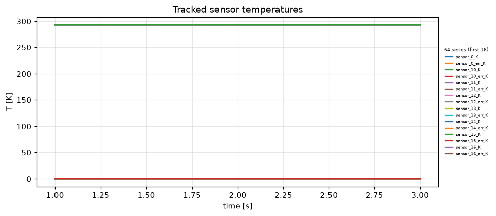
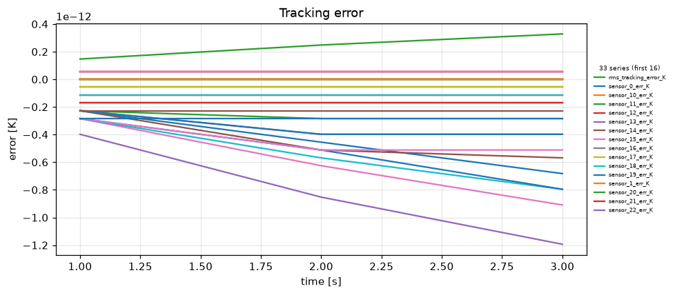
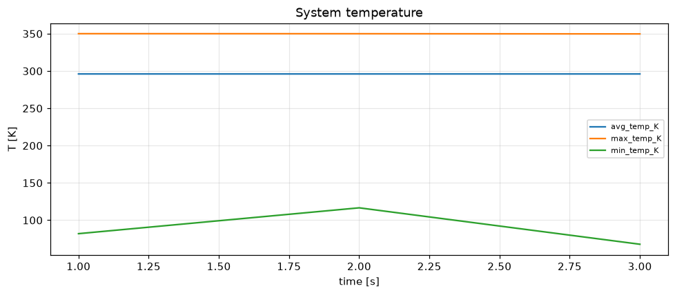
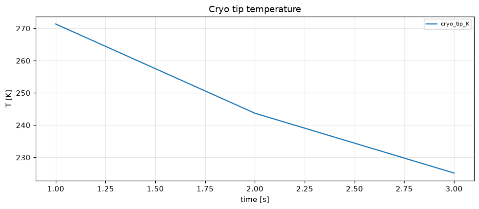
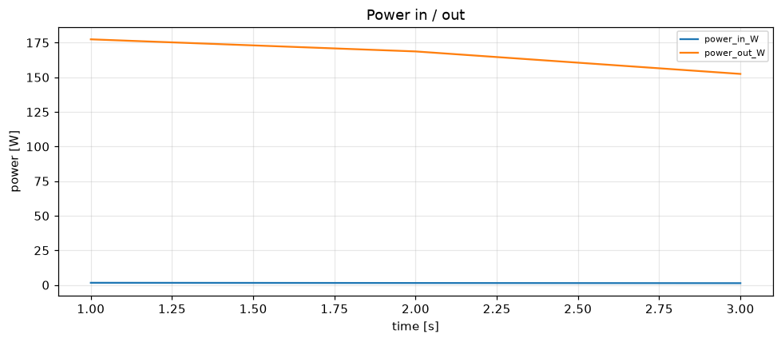
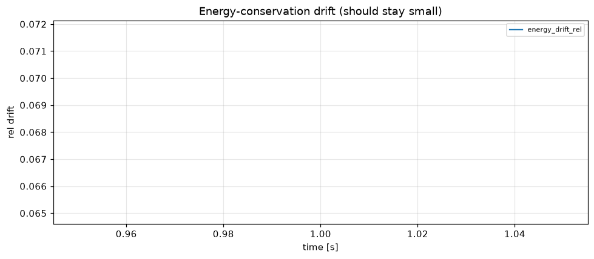

# Simulation report — CRYOSTAT_V2

- **Status:** completed
- **Output:** `simulations\CRYOSTAT_V2\20260806-121406`
- **Wall time:** 65.2 s
- **Sim time reached:** 3.0 / 3.0 s
- **Steps:** 3

## Summary metrics
- steps: 3
- sim_time_s: 3
- final_rms_tracking_error_K: 3.28596e-13
- peak_rms_tracking_error_K: 3.28596e-13
- peak_max_temp_K: 350.105
- final_cryo_tip_K: 225.142
- peak_power_in_W: 1.58664
- max_energy_drift_rel: 0.0683713

## Plots
- 
- 
- 
- 
- 
- 

## Events
See `events.log`.