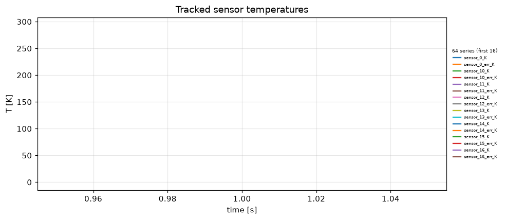
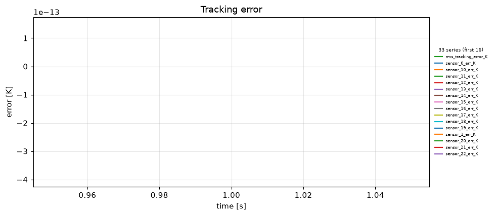
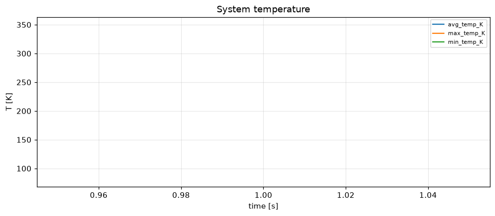
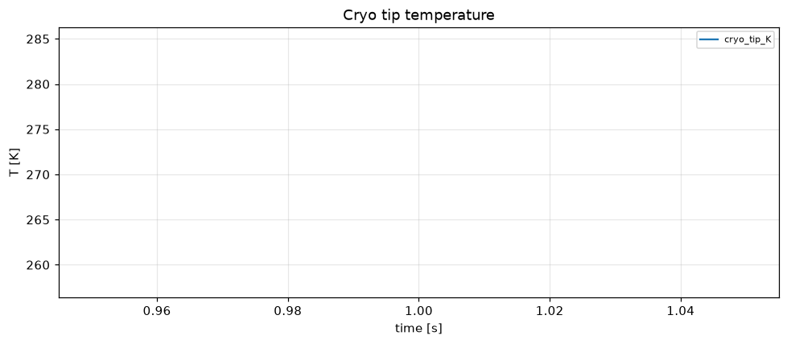
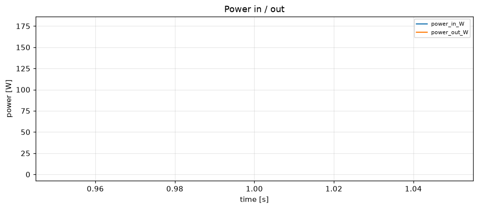

# Simulation report — CRYOSTAT_V2

- **Status:** completed
- **Output:** `simulations\CRYOSTAT_V2\20260806-131017`
- **Wall time:** 52.1 s
- **Sim time reached:** 1.0 / 1.0 s
- **Steps:** 1

## Summary metrics
- steps: 1
- sim_time_s: 1
- final_rms_tracking_error_K: 1.46922e-13
- peak_rms_tracking_error_K: 1.46922e-13
- peak_max_temp_K: 350.105
- final_cryo_tip_K: 271.354
- peak_power_in_W: 1.58664

## Plots
- 
- 
- 
- 
- 

## Events
See `events.log`.