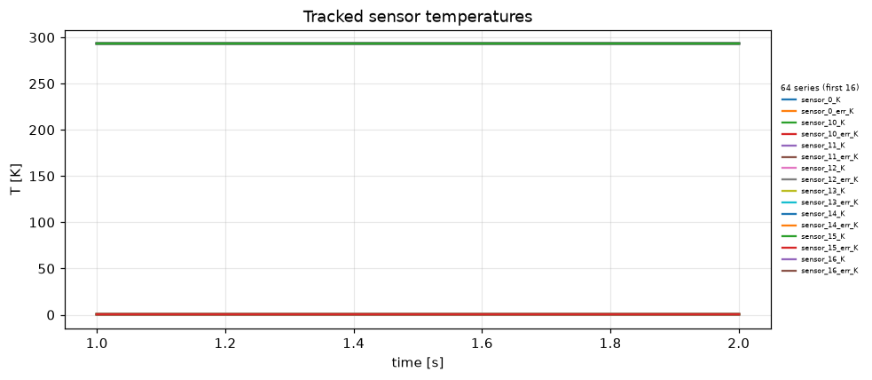
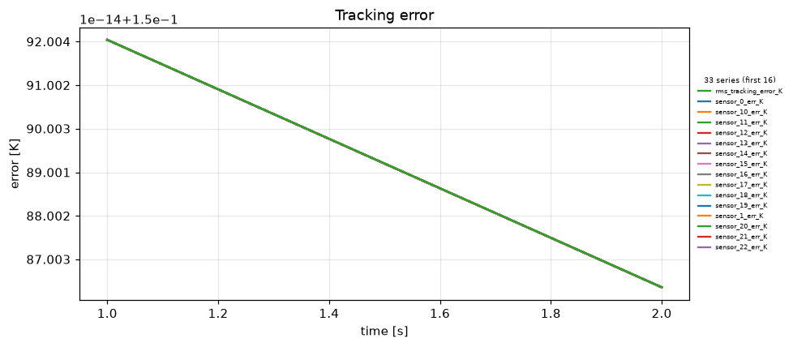
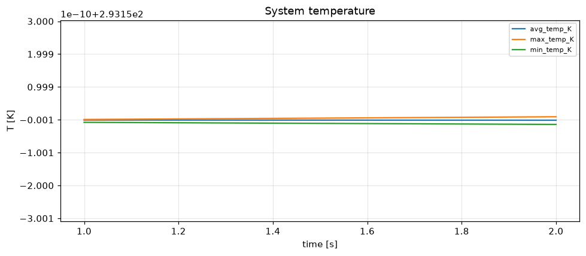
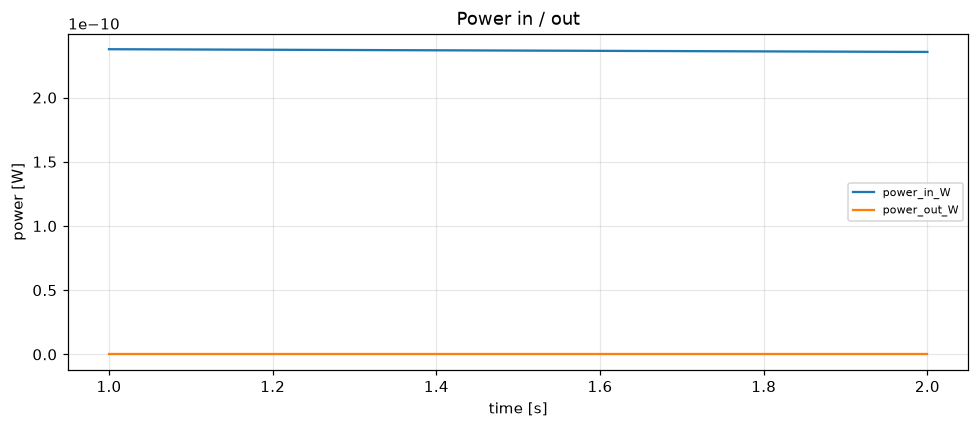

# Simulation report — HISPEC-CRYOSTAT-TEST-v4

- **Status:** completed
- **Output:** `simulations\HISPEC-CRYOSTAT-TEST-v4\20260806-130852`
- **Wall time:** 10.8 s
- **Sim time reached:** 2.0 / 2.0 s
- **Steps:** 2

## Summary metrics
- steps: 2
- sim_time_s: 2
- final_rms_tracking_error_K: 0.15
- peak_rms_tracking_error_K: 0.15
- peak_max_temp_K: 293.15
- peak_power_in_W: 2.37661e-10

## Plots
- 
- 
- 
- 

## Events
See `events.log`.