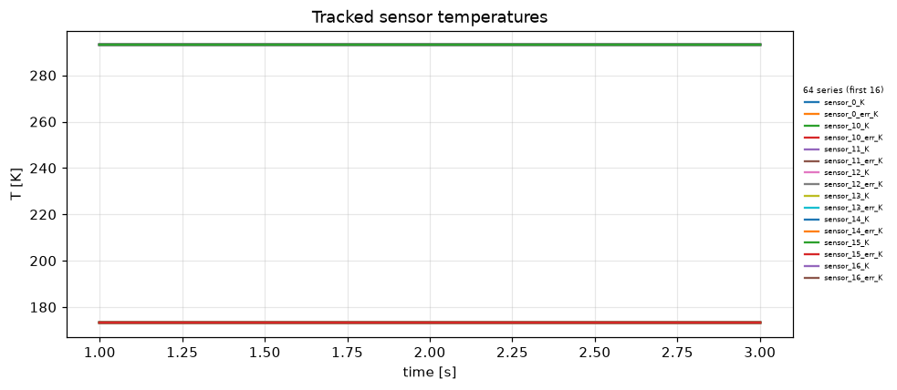
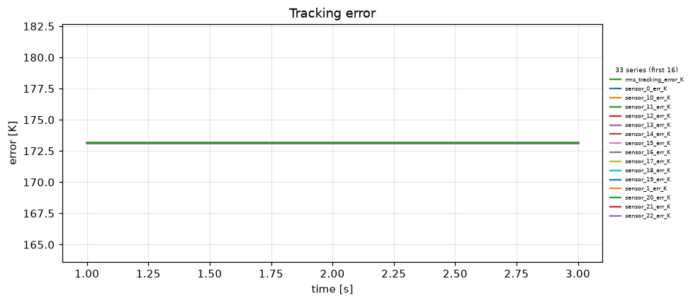
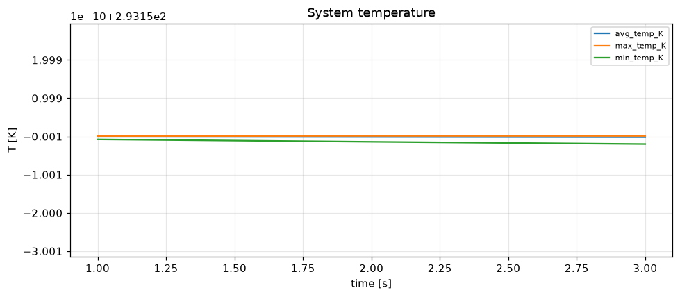
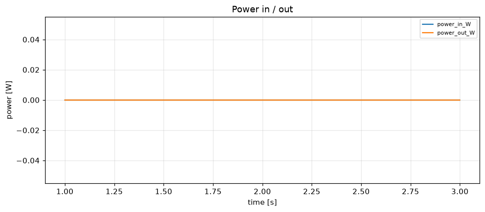
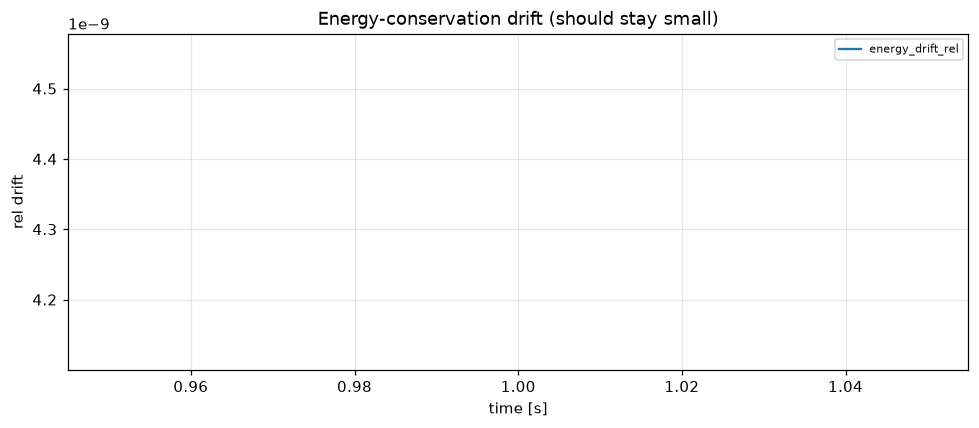

# Simulation report — HISPEC-CRYOSTAT-TEST-v4

- **Status:** completed
- **Output:** `simulations\HISPEC-CRYOSTAT-TEST-v4\20260806-151801`
- **Wall time:** 12.0 s
- **Sim time reached:** 3.0 / 3.0 s
- **Steps:** 3

## Summary metrics
- steps: 3
- sim_time_s: 3
- final_rms_tracking_error_K: 173.15
- peak_rms_tracking_error_K: 173.15
- peak_max_temp_K: 293.15
- peak_power_in_W: 0
- max_energy_drift_rel: 4.339e-09

## Plots
- 
- 
- 
- 
- 

## Events
See `events.log`.