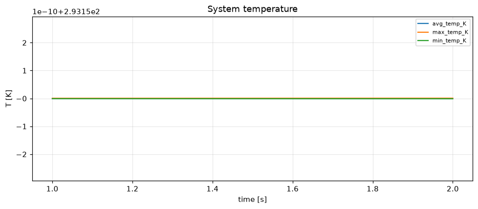
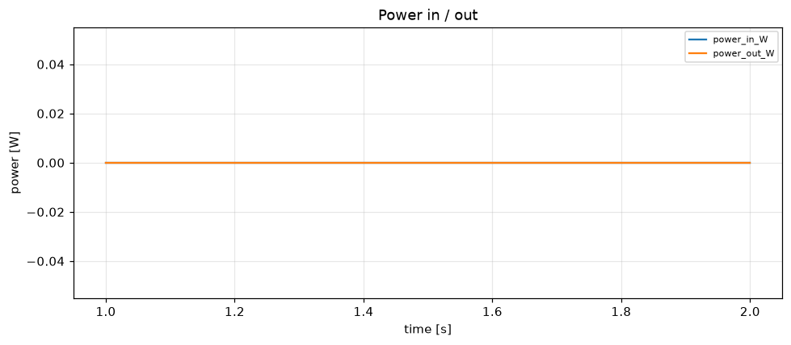

# Simulation report — SMALL_FILL

- **Status:** completed
- **Output:** `simulations\SMALL_FILL\20260806-124916`
- **Wall time:** 103.9 s
- **Sim time reached:** 2.0 / 2.0 s
- **Steps:** 2

## Summary metrics
- steps: 2
- sim_time_s: 2
- peak_max_temp_K: 293.15
- peak_power_in_W: 0

## Plots
- 
- 

## Events
See `events.log`.