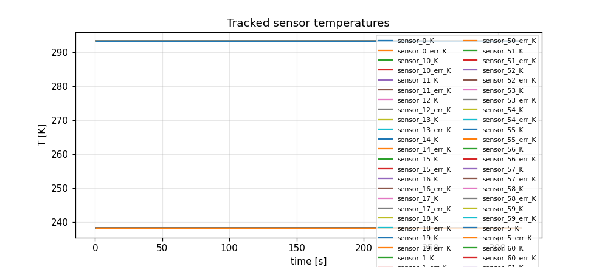
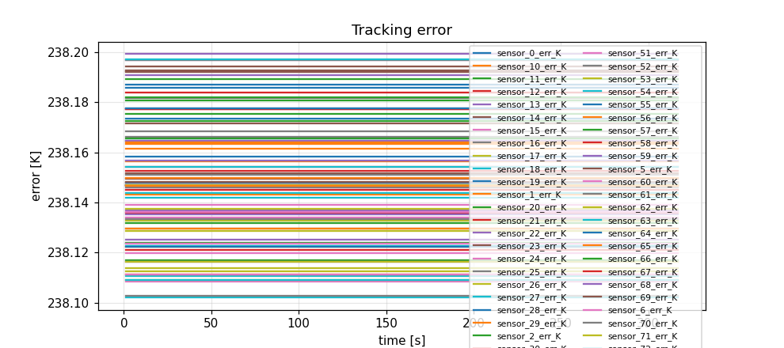
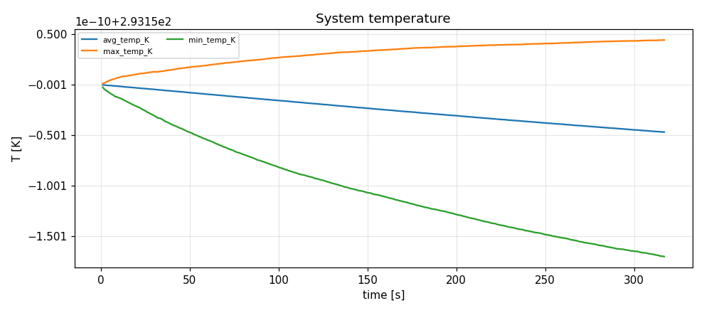
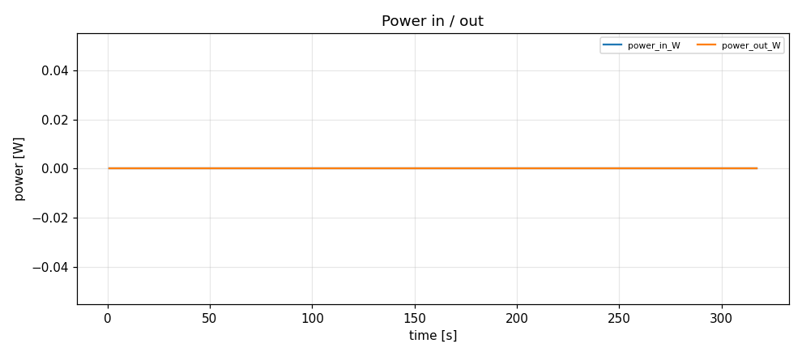
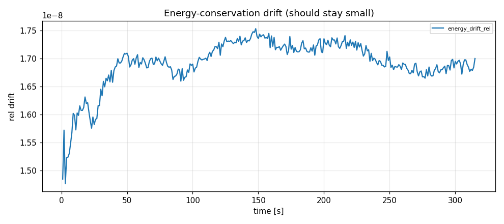

# Simulation report — STEP_FULL_MEDIUM

- **Status:** cancelled
- **Output:** `simulations\STEP_FULL_MEDIUM\20260803-164533`
- **Wall time:** 1292.0 s
- **Sim time reached:** 317.0 / 3600.0 s
- **Steps:** 317

## Summary metrics
- steps: 317
- sim_time_s: 317
- final_rms_tracking_error_K: 238.15
- peak_rms_tracking_error_K: 238.15
- peak_max_temp_K: 293.15
- peak_power_in_W: 0
- max_energy_drift_rel: 1.753e-08

## Plots
- 
- 
- 
- 
- 

## Events
See `events.log`.